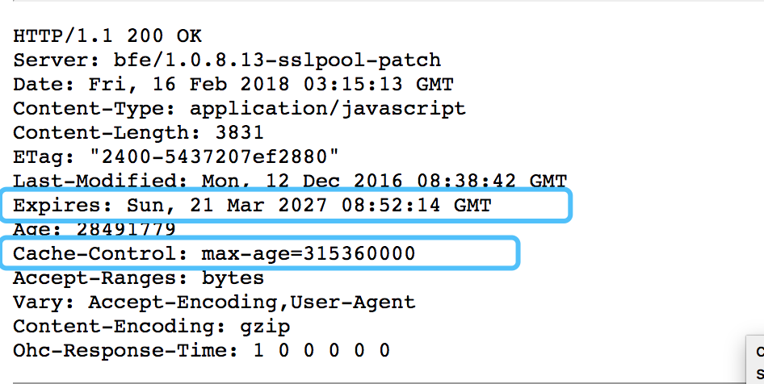

缓存文件: chrome浏览器 > `chrome://chrome-urls/` > 找到`chrome://cache`;

* Date 请求此文件时的(服务器)时间;
* expires (服务器)指名文件过期时间(http1.0标准,优先级低);
* Cache-Control 使用相对时间(http1.1标准,优先级高);
    * max-age 缓存的最大有效时间,单位秒(s),覆盖expires;
    * s-maxage: 只用于共享缓存,如CDN;
    * public: 缓存+多用户共享;
    * private: 私有缓存;
    * no-cache: 不缓存;
    * no-store: 绝对进制缓存;
    * must-revalidate: 如果页面过期,则去服务器获取;

* Last-Modified(服务器返回)/If-Modified-Since(浏览器请求)
    * Last-Modified:请求文件时,服务器返回的文件最后修改时间;
    * If-Modified-Since:浏览器请求时,{资源过期(使用Cache-Control标识的max-age) + 有Last-Modified}, 则带上If-Modified-Since, 用于服务器判断是否文件修改: HTTP200 / HTTP 304 (无需包体，节省浏览);

* Etag(服务器返回)/If-None-Match(浏览器请求)
    * Etag: 按服务器规则(apache中是索引节+大小+修改时间的hash值)生成的唯一标识;
    * If-Modified-Since: 浏览器请求时,{资源过期(使用Cache-Control标识的max-age) + 有Etag}, 则带上If-None-Match, 用于服务器判断是否文件修改: HTTP200 / HTTP 304 (无需包体，节省浏览);

* Last-Modified 和 Etag 的区别
    * Last-Modified判断的是修改时间; Etag判断的是文件内容+修改时间;
    * 优先级: Etag > Last-Modified;先判断Etag, 一致后再对比Last-Modified;
    * Last-Modified的精确度只到秒级, 如果一秒内多次修改, 会有判断不准确的情况;
    * 有的文件是定期自动生成的(实际内容不变), Last-Modified会修改, 但Etag不会变;

# 继续看
`https://www.cnblogs.com/shixiaomiao1122/p/7591556.html`