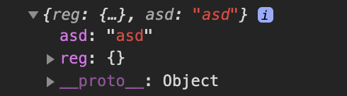
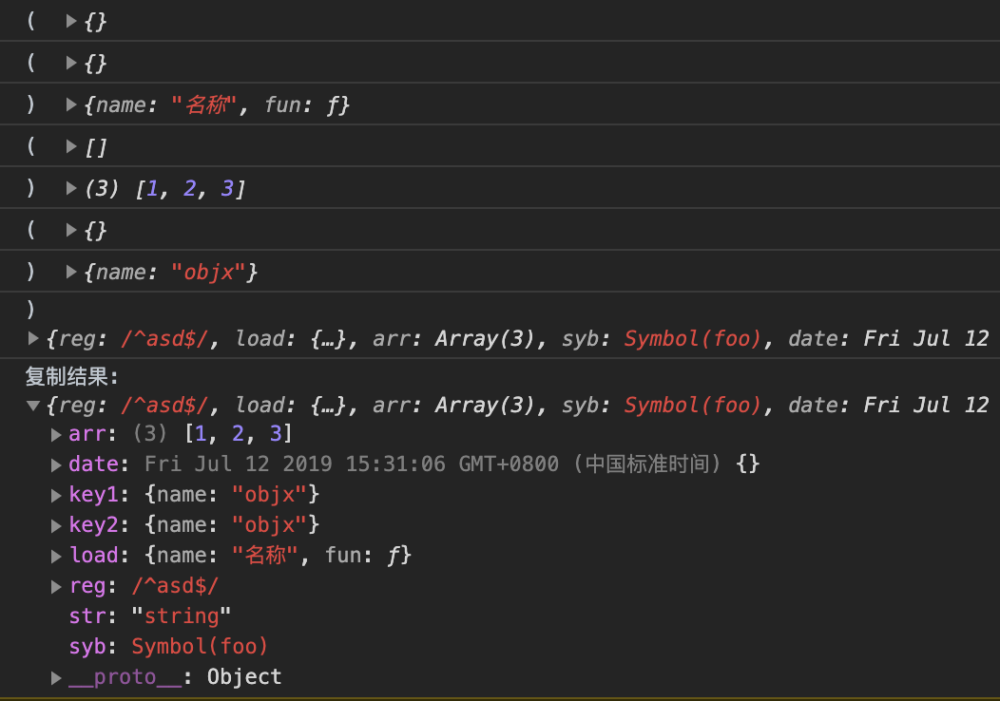

<style>img {max-width: 300px}</style>

[地址](https://juejin.im/post/5d23e750f265da1b855c7bbe)

### 什么是防抖和节流？有什么区别？如何实现？

-   防抖: 频繁触发的可能(类似键盘按键), 在规定时间之后, 再执行响应的按键;

```js
function debounce(fn) {
	let timer = null;
	return function() {
		clearTimeout(timer); // 清除上一次的, 以这次触发的为准
		timer = setTimeout(() => {
			fn.apply(this, arguments);
		}, 500); // 防抖时间
	};
}
```

-   节流: 触发一次后, 一段时间之内不会触发第二次, 直到限制解除

```js
function throttle(fn) {
	let allow = true;
	return function() {
		if (!allowed) return;
		allow = false;
		setTimeout(() => {
			fn.apply(this, arguments);
			allow = true;
		}, 500);
	};
}
```

### 介绍下深度优先遍历和广度优先遍历，如何实现？

```js
// 深度优先遍历DFS
deepTraversal1(node){
	let nodeList = []
	if(node!==null){
		// 保存本次node
		nodeList.push(node);
		// 准备下次node
		let {children=[]} = node;
		for(let i=0;i<children.length;i++){
			nodeList = nodeList.concat(deepTraversal1(children[i]))
		}
	}
	return nodeList;
}
```

```js
// 广度优先遍历 BFS
widthTraversal1(node){
	let nodeList = [];  // 最终数据
	let stack = [];  // 队列容器
	if(node){
		// 首次循环, push 一下;
		stack.push(node);
		while(stack.length){
			let item = stack.shift();
			nodeList.push(item);
			// 准备下一次循环的数据, stack可能多个数据
			let children = item.children||[];
			for(let i=0;i<children.length;i++){
				stack.push(children[i]); // stack每次存储一个层级
			}
		}
	}
	return nodeList;
}
```

### 第 6 题：请分别用深度优先思想和广度优先思想实现一个拷贝函数？

-   `(item) => JSON.parse(JSON.stringify( item ))` 的缺陷:

```js
let obj = {
	reg: /^asd$/, // 对象
	fun: function() {}, // 丢失
	syb: Symbol('foo'), // 丢失
	date: new Date(), // 字符串化
	asd: 'asd',
	// JSON实现深复制不能处理指向相同引用的情况，相同的引用会被重复复制
	key1: objx,
	key2: objx
};
let a = JSON.parse(JSON.stringify(obj));
console.log(a);
```



-   深度优先
```js
/**
 * 纯object => true
 * null|undefined|boolean|number|string|function ... => false
 */
function isObject(obj) {
	// 获取类型
	return ['Object', 'Array'].includes(
		Object.prototype.toString.call(obj).slice(8, -1)
	);
}

// 深度优先
function deepCopy(source, hash = new WeakMap()) {
	// 非'纯对象|数组' => 原值|原引用
	if (!isObject(source)) return source;
	// 多键值引用同一个(堆)(指针)地址, 直接返回;
	if (hash.has(source)) return hash.get(source);
	// 本次存储格式: 数组或对象
	let target = Array.isArray(source) ? [] : {};
	// 缓存, 真正的 target内容 会后续增加;
	hash.set(source, target);
	console.log('( ', target);

	for (let key in source) {
		// 数组: 0=>x, 1=>y, 2=>z
		// 对象: key=>value
		if (Object.prototype.hasOwnProperty.call(source, key)) {
			if (isObject(source[key])) {
				target[key] = deepCopy(source[key], hash);
			} else {
				target[key] = source[key];
			}
		}
	}

	console.log(') ', target);
	return target;
}

// 检测
const objx = { name: 'objx' };
let obj = {
	reg: /^asd$/, // 对象
	load: {
		name: '名称',
		fun: function() {
			console.log('print');
		} // 丢失
	},
	arr: [1, 2, 3],

	syb: Symbol('foo'), // 丢失
	date: new Date(), // 字符串化
	str: 'string',
	key1: objx,
	key2: objx
};

console.log(deepCopy(obj));
```



---

### 第 7 期：ES5/ES6 的继承除了写法以外还有什么区别？

1. class 声明不会提升;
2. 内部启用严格模式;
3. class 的所有方法（包括静态方法和实例方法）都是不可枚举的;
4. class 的所有方法（包括静态方法和实例方法）都没有原型对象 prototype，所以也没有[[construct]]，不能使用 new 来调用;
5. 必须使用 new 调用 class;
6. class 内部无法重写类名;

```sh
已知如下数组：
var arr = [ [1, 2, 2], [3, 4, 5, 5], [6, 7, 8, 9, [11, 12, [12, 13, [14] ] ] ], 10];
编写一个程序将数组扁平化去并除其中重复部分数据，最终得到一个升序且不重复的数组
```

```js
Array.prototype.flat = function() {
	return [].concat(
		...this.map(item => (Array.isArray(item) ? item.flat() : [item]))
	);
};
Array.prototype.unique = function() {
	return [...new Set(this)];
};

let oldArr = [1, 2, 32, [4, 5, [23], 8, 0], 1101, 8];
console.log(
	oldArr
		.flat()
		.unique()
		.sort((a, b) => a - b)
);
```
