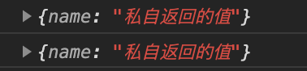
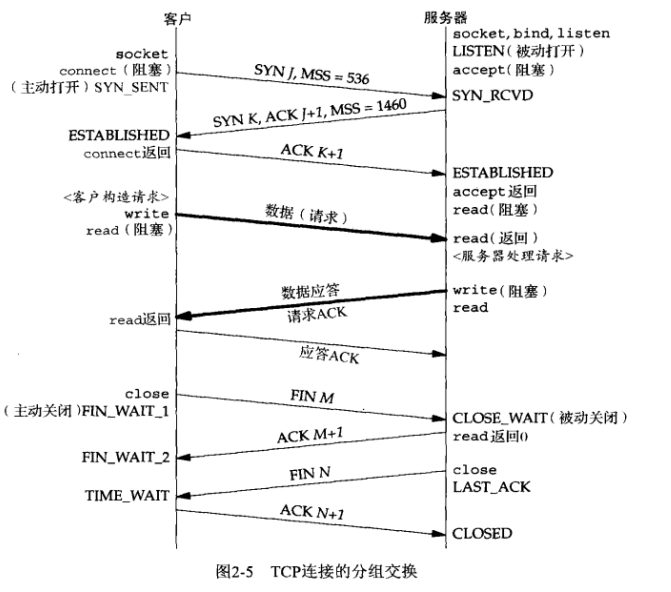

<style>img {max-width: 300px} .w4{max-width: 400px}.w5{max-width: 500px}</style>

### 第 14 题：情人节福利题，如何实现一个 new

```js
// 构造函数
function createPerson(name) {
	this.name = name;
	// return {name: '私自返回的值'}
}

// 构造函数
function _new(fn, ...arg) {
	const obj = Object.create(fn.prototype);
	const ret = fn.apply(obj, arg);

	// 一般情况(构造函数中没有 return 值), ret 是 undefined, 返回 obj;
	// 若有return值, 则构建函数返回指定值;
	return ret instanceof Object ? ret : obj;
}

console.log(new createPerson('四叶草'));
console.log(_new(createPerson, '四叶草'));
```




---

### 第 15 题：简单讲解一下 http2 的多路复用

> 在 HTTP/1 中，**每次请求都会建立一次 HTTP 连接**，也就是我们常说的 3 次握手 4 次挥手，这个过程在一次请求过程中占用了相当长的时间，即使开启了 Keep-Alive ，解决了多次连接的问题，但是依然有两个效率上的问题：
>
> - http/1.1 是同一个连接只能用一次， 如果开启了 keep-alive，虽然可以用多次，但是同一时刻只能有一个 HTTP 请求
> - 串行的文件传输。当请求 a 文件时，b 文件只能等待，等待 a 连接到服务器、服务器处理文件、服务器返回文件，这三个步骤。我们假设这三步用时都是 1 秒，那么 a 文件用时为 3 秒，b 文件传输完成用时为 6 秒，依此类推。（注：此项计算有一个前提条件，就是浏览器和服务器是单通道传输）
> - 连接数过多。我们假设 Apache 设置了最大并发数为 300，因为浏览器限制，浏览器发起的最大请求数为 6，也就是服务器能承载的最高并发为 50，当第 51 个人访问时，就需要等待前面某个请求处理完成。
>   HTTP/2 的多路复用就是为了解决上述的两个性能问题。

> 在 HTTP/2 中，有两个非常重要的概念，分别是帧（frame）和流（stream）。
> **帧代表着最小的数据单位**，每个帧会标识出该帧属于哪个流，**流也就是多个帧组成的数据流**。
> 多路复用，就是在一个 TCP 连接中可以存在多条流。换句话说，也就是可以发送多个请求，对端可以通过帧中的标识知道属于哪个请求。通过这个技术，可以避免 HTTP 旧版本中的队头阻塞问题，极大的提高传输性能。
>
> - 简单来说， 就是在同一个 TCP 连接，同一时刻可以传输多个 HTTP 请求

### 第 16 题：谈谈你对 TCP 三次握手和四次挥手的理解




---

### 第 20 题：介绍下 npm 模块安装机制，为什么输入 npm install 就可以自动安装对应的模块？

1. npm 模块安装机制：

- 发出 npm install 命令
- 查询 node_modules 目录之中是否已经存在指定模块
  - 若存在，不再重新安装
  - 若不存在, npm 向 registry 查询模块压缩包的网址
    - 下载压缩包，存放在根目录下的.npm 目录里
    - 解压压缩包到当前项目的 node_modules 目录
